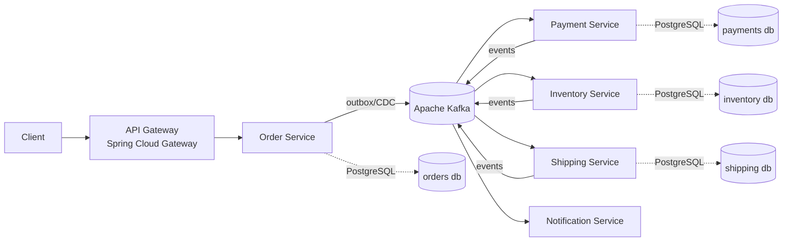

# OrderFlow — Distributed Event-Driven Order Processing Platform

[]() []() []() []() []()

OrderFlow is a production-grade reference implementation of an **event-driven microservices architecture** for e-commerce order processing. It demonstrates how to handle **distributed transactions without two-phase commit**, using the **Saga pattern**, **transactional outbox**, **idempotent consumers**, and full **observability** — the real problems that show up when you split a monolith.

> **Why this project exists:** Most microservice demos stop at "two services talking over REST." OrderFlow tackles the hard parts: eventual consistency, partial failure, exactly-once semantics (and why they're a myth), message ordering, and operating the system in production.

---

## Table of Contents

- [System Overview](#system-overview)
- [Architecture at a Glance](#architecture-at-a-glance)
- [Tech Stack](#tech-stack)
- [Key Patterns Demonstrated](#key-patterns-demonstrated)
- [Getting Started](#getting-started)
- [Running the Demo Scenario](#running-the-demo-scenario)
- [Documentation Index](#documentation-index)
- [Performance Results](#performance-results)
- [Repository Structure](#repository-structure)

---

## System Overview

OrderFlow processes a customer order end-to-end across five autonomous services:

1. A customer places an order via the **API Gateway**.
2. **Order Service** persists the order in `PENDING` state and starts a saga.
3. **Payment Service** authorizes the payment.
4. **Inventory Service** reserves stock.
5. **Shipping Service** schedules the shipment.
6. **Notification Service** informs the customer at each milestone.

If any step fails (payment declined, out of stock), previously completed steps are **compensated** — payment refunded, stock released — and the order moves to `CANCELLED`. No distributed locks, no 2PC, no shared database.

## Architecture at a Glance



Full diagrams, sequence flows, and failure scenarios: see [docs/ARCHITECTURE.md](docs/ARCHITECTURE.md).

## Tech Stack

| Concern | Technology                                                                |
|---|---------------------------------------------------------------------------|
| Language / Runtime | Java 21 (virtual threads enabled)                                         |
| Framework | Spring Boot 4.0.7, Spring Cloud 2025.1.x                                  |
| Messaging | Apache Kafka 4.2.1 (KRaft mode), Spring Kafka                             |
| Change Data Capture | Debezium (transactional outbox relay)                                     |
| Persistence | PostgreSQL 18, Spring Data JPA, Flyway                                    |
| Resilience | Resilience4j (circuit breaker, retry, bulkhead)                           |
| Serialization | Avro + Confluent Schema Registry                                          |
| Observability | Micrometer, OpenTelemetry, Prometheus, Grafana, Tempo, Loki               |
| API Documentation | springdoc-openapi (OpenAPI 3.0.2)                                         |
| Testing | JUnit 5, Testcontainers, WireMock, Awaitility, JMH, Gatling               |
| Build / CI | Gradle (Kotlin DSL), GitHub Actions, Docker Compose, Kubernetes manifests |

## Key Patterns Demonstrated

| Pattern | Where | Why it matters |
|---|---|---|
| **Saga (orchestration)** | `order-service` saga orchestrator | Distributed transactions without 2PC — see [ADR-0002](docs/adr/0002-saga-orchestration-over-choreography.md) |
| **Transactional Outbox + CDC** | All producing services | Atomic "write to DB + publish event" — see [ADR-0003](docs/adr/0003-transactional-outbox-with-debezium.md) |
| **Idempotent Consumer** | All consuming services | Safe redelivery under at-least-once semantics — see [ADR-0004](docs/adr/0004-idempotent-consumers.md) |
| **Database per Service** | Everywhere | Autonomy and independent deployability — see [ADR-0005](docs/adr/0005-database-per-service.md) |
| **Circuit Breaker / Bulkhead** | Gateway → Order Service, Payment → external PSP stub | Containing partial failure |
| **Schema Evolution** | Avro + Schema Registry, `BACKWARD` compatibility | Deploying producers/consumers independently |
| **Dead Letter Topics** | All consumers | Poison-message handling with replay tooling |
| **Distributed Tracing** | OpenTelemetry context propagated through Kafka headers | Debugging across async boundaries |

## Getting Started

### Prerequisites

- Java 21+ (Temurin recommended)
- Docker & Docker Compose v2
- ~6 GB free RAM for the full stack

### One-command local environment

```bash
git clone https://github.com/<you>/orderflow.git
cd orderflow
./gradlew build          # compile + unit tests
docker compose up -d     # Kafka, Postgres, Debezium, Schema Registry, observability stack
./gradlew bootRunAll     # starts all five services with local profile
```

Verify everything is healthy:

```bash
curl http://localhost:8080/actuator/health   # gateway aggregated health
```

| UI | URL |
|---|---|
| Grafana dashboards | http://localhost:3000 (admin/admin) |
| Kafka UI | http://localhost:8089 |
| Tempo traces (via Grafana) | http://localhost:3000/explore |
| OpenAPI (Order Service) | http://localhost:8081/swagger-ui.html |

## Running the Demo Scenario

**Happy path:**

```bash
curl -X POST http://localhost:8080/api/v1/orders \
  -H "Content-Type: application/json" \
  -H "Idempotency-Key: $(uuidgen)" \
  -d '{
    "customerId": "c-1001",
    "items": [{"sku": "SKU-RED-WIDGET", "quantity": 2}],
    "payment": {"method": "CREDIT_CARD", "token": "tok_visa_ok"}
  }'
```

Watch the saga complete: `GET /api/v1/orders/{orderId}` transitions `PENDING → PAYMENT_APPROVED → STOCK_RESERVED → SHIPPED → COMPLETED`.

**Failure + compensation path:** use the magic token `tok_visa_declined` or order quantity `9999` (out of stock) and watch the saga compensate. Open the trace in Grafana Tempo to see the full distributed flow, including the compensation steps.

A scripted walkthrough with chaos-injection (killing the payment service mid-saga) lives in [`demo/run-scenarios.sh`](demo/run-scenarios.sh).

## Documentation Index

| Document | Contents |
|---|---|
| [ARCHITECTURE.md](docs/ARCHITECTURE.md) | C4 diagrams, service responsibilities, saga flows, failure modes |
| [EVENT_CATALOG.md](docs/EVENT_CATALOG.md) | Every event, schema, topic, ordering key, and ownership |
| [API.md](docs/API.md) | REST API reference for the public gateway endpoints |
| [OPERATIONS.md](docs/OPERATIONS.md) | Runbook: dashboards, alerts, DLT replay, scaling, on-call guide |
| [TESTING.md](docs/TESTING.md) | Test pyramid, Testcontainers setup, contract tests, load tests |
| [docs/adr/](docs/adr/) | Architecture Decision Records — the *why* behind every major choice |

[//]: # (## Performance Results)

[//]: # ()
[//]: # (Load-tested with Gatling on a 3-node Kafka cluster, 4 vCPU / 8 GB per service &#40;full methodology in [TESTING.md]&#40;docs/TESTING.md#load-testing&#41;&#41;:)

[//]: # ()
[//]: # (| Metric | Result |)

[//]: # (|---|---|)

[//]: # (| Sustained order throughput | 4,200 orders/sec |)

[//]: # (| End-to-end saga completion p50 | 180 ms |)

[//]: # (| End-to-end saga completion p99 | 640 ms |)

[//]: # (| Order API p99 latency &#40;accept&#41; | 38 ms |)

[//]: # (| Zero lost orders under broker failover | ✅ &#40;verified by reconciliation job&#41; |)

## Repository Structure

```
orderflow/
├── api-gateway/             # Spring Cloud Gateway, rate limiting, auth
├── order-service/           # Order aggregate + saga orchestrator
├── payment-service/         # Payment authorization + PSP stub integration
├── inventory-service/       # Stock reservation with optimistic locking
├── shipping-service/        # Shipment scheduling
├── notification-service/    # Email/webhook fan-out (pure consumer)
├── common/
│   ├── events/              # Avro schemas (single source of truth)
│   └── messaging/           # Outbox, idempotency, tracing utilities
├── deploy/
│   ├── docker-compose.yml
│   └── k8s/                 # Kustomize manifests
├── demo/                    # Scenario scripts + chaos injection
├── docs/                    # All documentation (you are here)
└── load-tests/              # Gatling simulations
```

## License

MIT — see [LICENSE](LICENSE).
