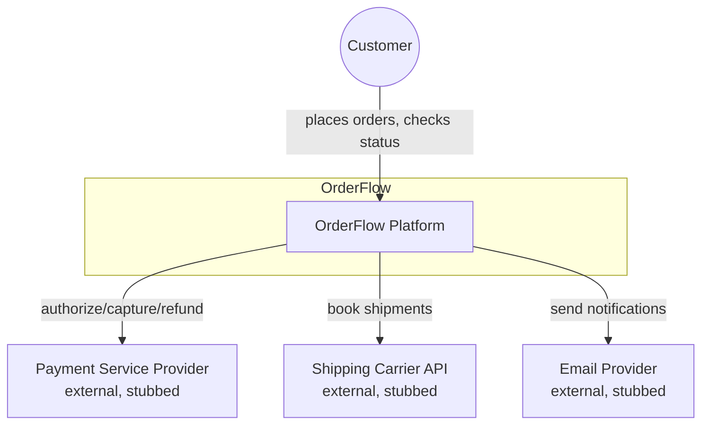
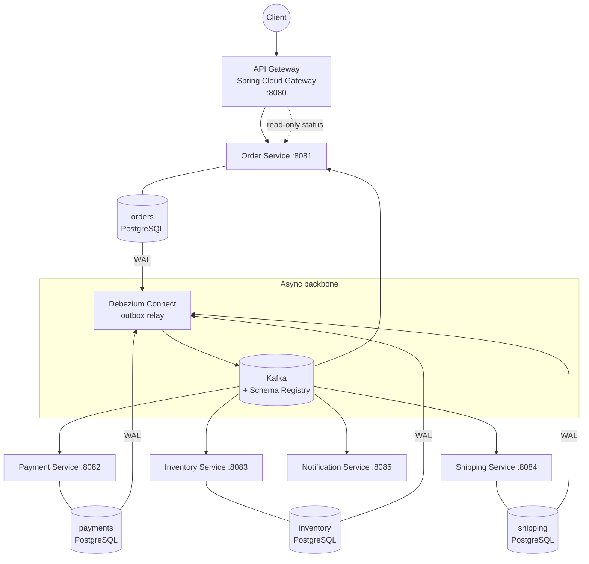
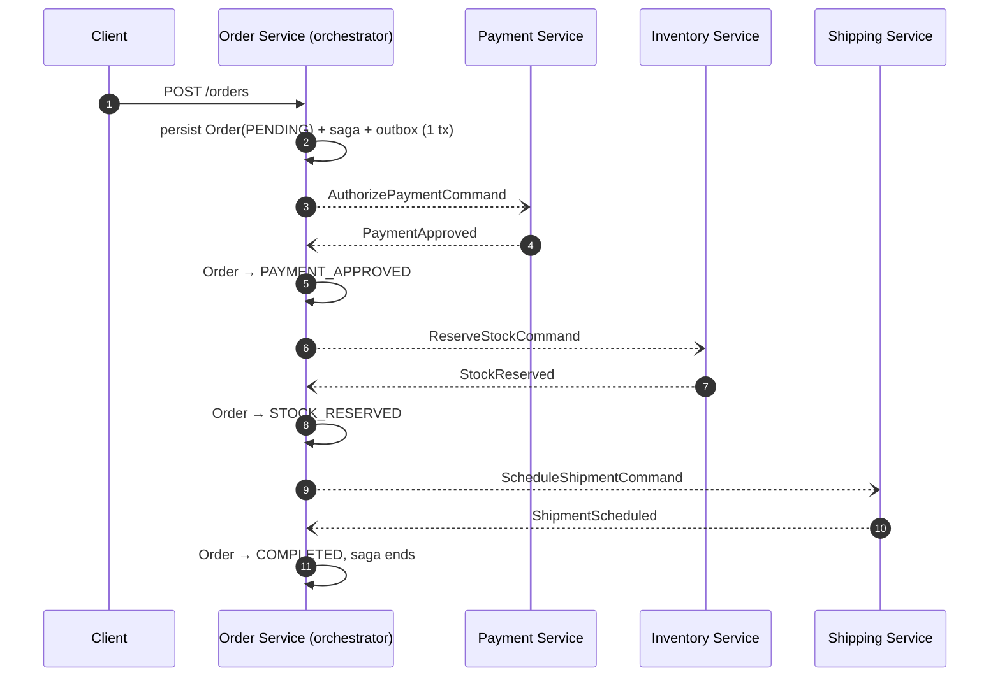
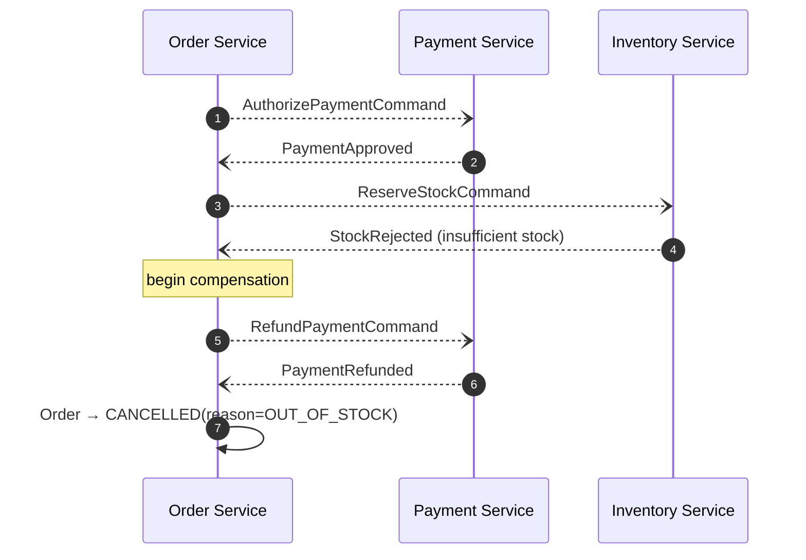

# OrderFlow Architecture

This document describes the system architecture: service responsibilities, communication model, the order saga, data ownership, and how the system behaves under failure. For the reasoning behind each decision, see the [ADRs](adr/).

---

## 1. Architectural Style

OrderFlow is an **event-driven microservices** system. Services communicate asynchronously through **Apache Kafka** using domain events; synchronous REST is used only at the edge (client → gateway → order-service) where a request/response contract is required. Each service owns its data exclusively (database-per-service).

Guiding constraints:

- **No distributed transactions.** Consistency across services is achieved with sagas and compensation, not 2PC.
- **At-least-once delivery everywhere.** Every consumer is idempotent; duplicates are expected and handled.
- **Autonomy over reuse.** Services share event *schemas* (Avro), never code that contains business logic, and never databases.
- **Built to be operated.** Every async hop is traced, every queue is monitored, every poison message has a dead-letter path and a replay procedure.

## 2. C4 — Context



## 3. C4 — Containers



**Key point:** services never publish to Kafka directly from request threads. They write events to an `outbox` table in the same local transaction as their state change; Debezium tails the WAL and relays rows to Kafka. This guarantees state change and event publication are atomic ([ADR-0003](adr/0003-transactional-outbox-with-debezium.md)).

## 4. Service Responsibilities

| Service | Owns | Publishes | Consumes |
|---|---|---|---|
| **api-gateway** | Routing, rate limiting, JWT validation, idempotency-key enforcement | — | — |
| **order-service** | `Order` aggregate, saga orchestration, order state machine | `OrderCreated`, `OrderCompleted`, `OrderCancelled`, saga commands | All saga replies |
| **payment-service** | `Payment` aggregate, PSP integration | `PaymentApproved`, `PaymentDeclined`, `PaymentRefunded` | `AuthorizePaymentCommand`, `RefundPaymentCommand` |
| **inventory-service** | `StockItem`, reservations | `StockReserved`, `StockRejected`, `StockReleased` | `ReserveStockCommand`, `ReleaseStockCommand` |
| **shipping-service** | `Shipment` | `ShipmentScheduled`, `ShipmentFailed` | `ScheduleShipmentCommand` |
| **notification-service** | Nothing (stateless fan-out) | — | All public domain events |

## 5. The Order Saga

The saga is **orchestrated** by `order-service` ([ADR-0002](adr/0002-saga-orchestration-over-choreography.md)). The orchestrator is a persisted state machine: each saga instance is a row in `saga_instance`, advanced exclusively by incoming events, so it survives restarts and is horizontally scalable (instances are partitioned by `orderId`).

### 5.1 Happy path



### 5.2 Compensation path (stock rejected)



Compensation rules:

- Compensating actions are **idempotent** and **commutative where possible** (refunding twice is a no-op; releasing an unreserved stock line is a no-op).
- Compensation never fails the saga: if a compensating command itself errors, it is retried with exponential backoff; after exhaustion it lands in the **saga dead-letter queue** and pages on-call (see [OPERATIONS.md](OPERATIONS.md#saga-stuck)).
- A saga that receives no reply within its **step timeout** (default 30 s, configured per step) treats the step as failed and compensates. Late replies after a timeout are detected by saga version and discarded.

### 5.3 Order state machine

```
PENDING ──PaymentApproved──▶ PAYMENT_APPROVED ──StockReserved──▶ STOCK_RESERVED ──ShipmentScheduled──▶ COMPLETED
   │                              │                                   │
   │ PaymentDeclined              │ StockRejected (refund)            │ ShipmentFailed (release + refund)
   ▼                              ▼                                   ▼
CANCELLED ◀───────────────── CANCELLED ◀───────────────────────── CANCELLED
```

Every transition is recorded in `order_state_history` for auditability.

## 6. Messaging Design

### 6.1 Topics and partitioning

All saga messages are keyed by `orderId`, which guarantees **per-order ordering** within a partition while allowing global parallelism. Topic layout, retention, and schemas are catalogued in [EVENT_CATALOG.md](EVENT_CATALOG.md).

### 6.2 Delivery semantics

- Producers: `acks=all`, `enable.idempotence=true`, outbox relay → effectively *at-least-once into Kafka, no loss, no producer-side duplicates*.
- Consumers: manual offset commit **after** successful local transaction; combined with the idempotency table ([ADR-0004](adr/0004-idempotent-consumers.md)) this yields *effectively-once processing*.
- We deliberately do **not** rely on Kafka EOS/transactions across services — the consuming side still needs idempotency because the side effects (DB writes, PSP calls) are outside Kafka.

### 6.3 Poison messages

Each consumer group has a retry topic (`<topic>.retry`, delayed redelivery) and a dead-letter topic (`<topic>.dlt`). Deserialization failures and non-retryable business errors skip retries and go straight to DLT with diagnostic headers (`x-exception`, `x-original-partition`, `x-trace-id`). Replay tooling: [OPERATIONS.md](OPERATIONS.md#dlt-replay).

## 7. Data Architecture

- **PostgreSQL per service**, schema migrations with Flyway, no cross-service joins ever.
- **Inventory** uses optimistic locking (`@Version`) on stock rows; contention on hot SKUs is mitigated by reservation batching.
- **Read model:** order status queries are served by `order-service` directly (it is the aggregate owner). A CQRS read-model service was considered and rejected at this scale — recorded in [ADR-0005](adr/0005-database-per-service.md#consequences).
- **Reconciliation job** (`order-service`, nightly): cross-checks orders vs. payments vs. reservations through events replayed from Kafka (compacted state topics), proving no money or stock leaks. This is also the loss-detection mechanism used in failover tests.

## 8. Cross-Cutting Concerns

### Observability
- **Tracing:** OpenTelemetry; trace context is propagated through Kafka headers, so a single trace spans REST + every async hop, including compensations.
- **Metrics:** Micrometer → Prometheus. RED metrics per endpoint, consumer lag, saga duration histogram, outbox lag, DLT depth.
- **Logs:** JSON to Loki, correlated by `traceId` and `orderId`.
- Dashboards and alert rules are versioned in `deploy/observability/`.

### Resilience
- Resilience4j circuit breaker + bulkhead on every synchronous external call (gateway → order-service, payment-service → PSP stub).
- Kafka consumers use cooperative rebalancing (`CooperativeStickyAssignor`) to avoid stop-the-world rebalances during deploys.
- Graceful shutdown drains in-flight Kafka records before the pod terminates (`spring.lifecycle.timeout-per-shutdown-phase`).

### Security
- JWT (resource-server) validated at the gateway; service-to-Kafka uses SASL/SCRAM with per-service credentials and topic ACLs.
- No PII in events: customer data is referenced by ID; the payment token is a PSP token, never a PAN.

## 9. Failure Mode Analysis

| Failure | Behavior | Recovery |
|---|---|---|
| Payment service down mid-saga | Commands accumulate in Kafka; saga step times out → compensation, or completes late if service returns within timeout | Automatic on service restart |
| Kafka broker loss (1 of 3) | Producers/consumers fail over to new partition leaders; `acks=all` + `min.insync.replicas=2` prevents loss | Automatic |
| Outbox relay (Debezium) down | Events delayed, never lost (rows remain in outbox); `outbox_lag_seconds` alert fires | Restart connector; relay resumes from WAL position |
| Duplicate event delivery | Idempotency table short-circuits processing | None needed |
| Poison message | Routed to DLT, alert fires | Operator replay after fix ([runbook](OPERATIONS.md#dlt-replay)) |
| Order service crash between DB commit and... | Impossible state by design: DB commit *is* the publication (outbox) | — |
| Saga stuck (compensation exhausted) | Saga DLQ + page | Manual resolution procedure in runbook |

## 10. What I Would Do Differently at 10× Scale

Honest limitations, because architecture is about trade-offs:

- Move the saga orchestrator's timeout scheduling from DB polling to a dedicated scheduler (e.g., Kafka-based timer wheel) — polling is the first bottleneck (~15k active sagas/instance).
- Introduce a separate **read-model/CQRS service** for order history queries once read traffic dominates.
- Replace per-request Schema Registry lookups with client-side schema caching warm-up at startup (already mitigated, would harden).
- Evaluate Kafka tiered storage for the event archive instead of unbounded retention on state topics.
